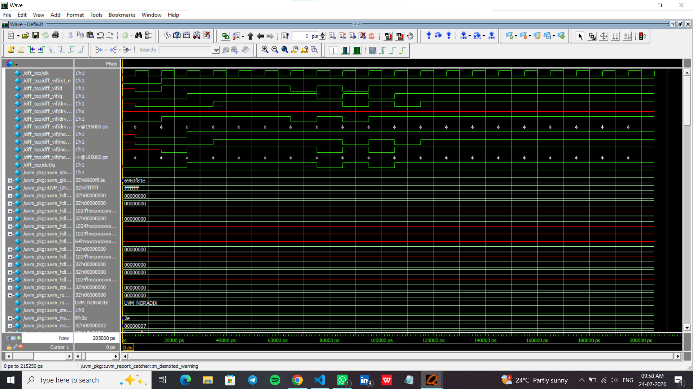
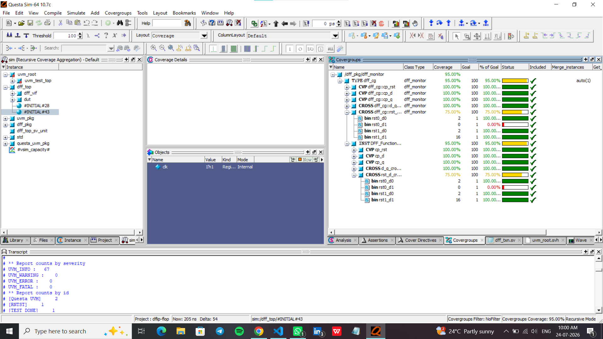

# D Flip-Flop Verification using SystemVerilog UVM

## Overview

This project implements and verifies a **positive-edge triggered D Flip-Flop** using the **Universal Verification Methodology (UVM)** in **SystemVerilog**. The verification environment is built using reusable UVM components and follows a coverage-driven verification approach.

The project validates the DUT functionality using constrained-random stimulus, a scoreboard, SystemVerilog Assertions (SVA), code coverage, and functional coverage.

---

## Project Objectives

- Design a positive-edge triggered D Flip-Flop RTL.
- Build a reusable UVM verification environment.
- Verify DUT functionality using constrained-random testing.
- Detect mismatches using a scoreboard.
- Validate functionality using SystemVerilog Assertions (SVA).
- Measure verification completeness using code and functional coverage.

---

## Verification Environment

The UVM testbench consists of the following components:

- Interface
- Transaction
- Sequence
- Sequencer
- Driver
- Monitor
- Agent
- Environment
- Scoreboard
- Test
- Assertions (SVA)
- Functional Coverage

---

## Verification Flow

```
                +----------------+
                |    Sequence    |
                +----------------+
                        |
                        v
                +----------------+
                |   Sequencer    |
                +----------------+
                        |
                        v
                +----------------+
                |     Driver     |
                +----------------+
                        |
                        v
                +----------------+
                |  D Flip-Flop   |
                |      DUT       |
                +----------------+
                        |
                        v
                +----------------+
                |    Monitor     |
                +----------------+
                   |     |     |
                   |     |     |
                   v     v     v
            +----------+ | +----------------------+
            |Scoreboard| | | Functional Coverage  |
            +----------+ | +----------------------+
                         |
                         v
                 SystemVerilog Assertions
```

---

## Project Files

| File | Description |
|------|-------------|
| dff_design.sv | RTL implementation of D Flip-Flop |
| dff_if.sv | Interface |
| dff_pkg.sv | UVM package |
| dff_txn.sv | Transaction class |
| dff_seq.sv | Sequence |
| dff_seqr.sv | Sequencer |
| dff_driver.sv | Driver |
| dff_monitor.sv | Monitor |
| dff_agent.sv | Agent |
| dff_env.sv | Environment |
| dff_sb.sv | Scoreboard |
| dff_test.sv | Test |
| dff_top.sv | Top module |
| run.do | QuestaSim simulation script |

---

## Tools & Technologies

| Tool | Version |
|------|---------|
| Language | SystemVerilog |
| Methodology | UVM 1.1d |
| Simulator | QuestaSim 10.7c |

---

## Verification Results

| Metric | Result |
|---------|--------|
| UVM Errors | 0 |
| UVM Fatal | 0 |
| Statement Coverage | 100% |
| Branch Coverage | 100% |
| Toggle Coverage | 100% |
| Functional Coverage | 95% |

---

## Simulation Waveform

The waveform below demonstrates the positive-edge triggered behavior of the D Flip-Flop under constrained-random stimulus generated by the UVM environment.



---

## Functional Coverage

The functional coverage report achieved **95% coverage**.

The uncovered bin corresponds to:

- **rst_n = 0**
- **D = 1**

This combination is not exercised because reset is asserted before the driver begins generating transactions. Since the DUT ignores **D** while reset is active, this scenario does not impact functional correctness. It may be covered through a directed reset test or excluded using `ignore_bins` if permitted by the verification plan.



---

## UVM Test Summary

| Metric | Result |
|---------|--------|
| UVM_INFO | 67 |
| UVM_WARNING | 0 |
| UVM_ERROR | 0 |
| UVM_FATAL | 0 |
| Test Status | ✅ PASS |

---

## How to Run

### Compile and Simulate

Execute the following command in QuestaSim:

```tcl
do run.do
```

The script performs the following tasks:

- Creates the work library
- Compiles RTL and UVM files
- Starts simulation
- Opens waveform viewer
- Runs the complete test
- Generates code coverage
- Displays the coverage report

---

## Repository Structure

```
DFF-UVM-Verification
│
├── docs/
│   ├── waveform.png
│   └── functional_coverage.png
│
├── .gitignore
├── LICENSE
├── README.md
├── dff_design.sv
├── dff_if.sv
├── dff_pkg.sv
├── dff_txn.sv
├── dff_seq.sv
├── dff_seqr.sv
├── dff_driver.sv
├── dff_monitor.sv
├── dff_agent.sv
├── dff_env.sv
├── dff_sb.sv
├── dff_test.sv
├── dff_top.sv
└── run.do
```

---

## Skills Demonstrated

- RTL Design
- SystemVerilog
- Universal Verification Methodology (UVM)
- Constrained-Random Verification
- Functional Coverage
- Code Coverage
- SystemVerilog Assertions (SVA)
- Scoreboard-Based Verification
- Transaction-Level Modeling (TLM)
- QuestaSim Simulation
- Verification Planning
- Debugging and Analysis

---

## Future Enhancements

- Directed reset test
- Regression automation
- Parameterized D Flip-Flop
- Continuous Integration (GitHub Actions)
- Makefile support
- HTML coverage report generation

---

## Author

**Chidanand Kumbalavati**

Aspiring ASIC Design Verification Engineer
